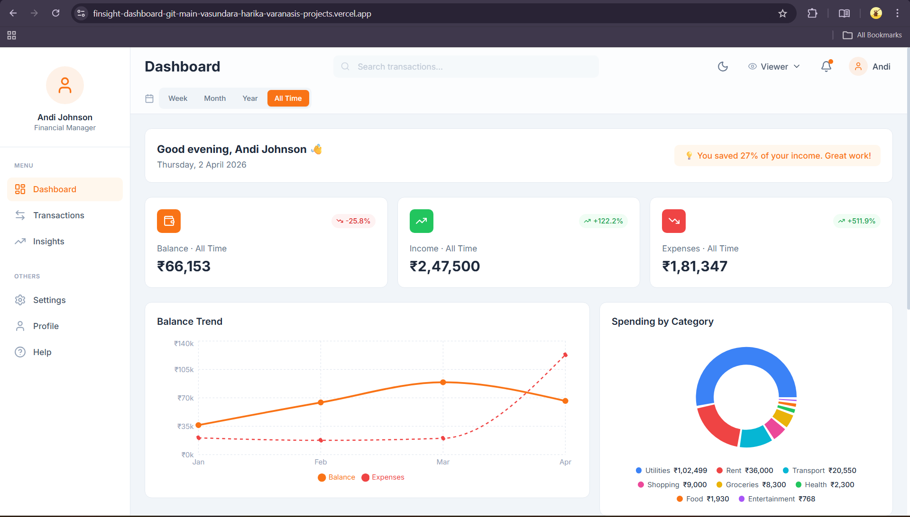
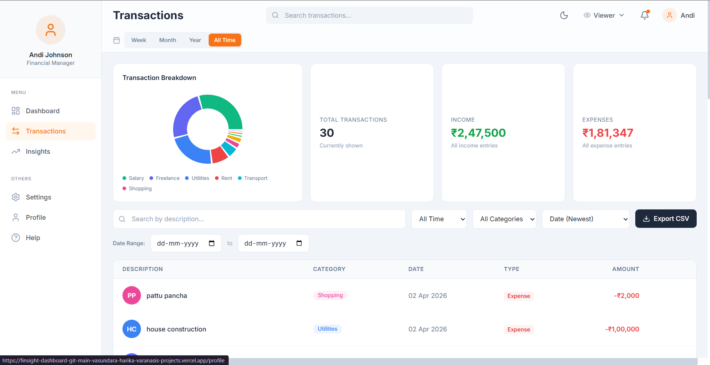
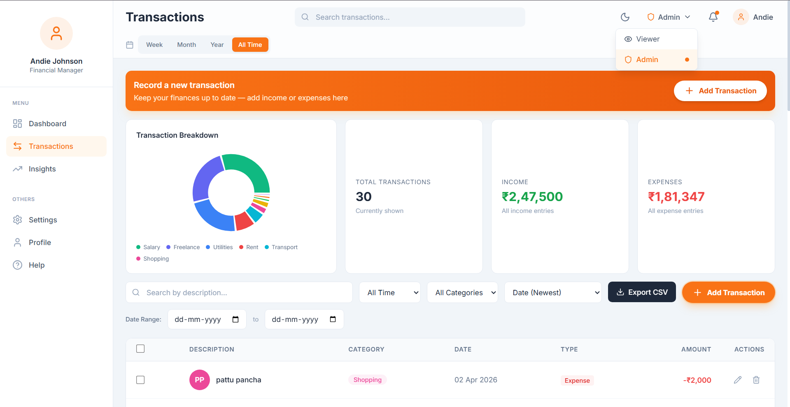
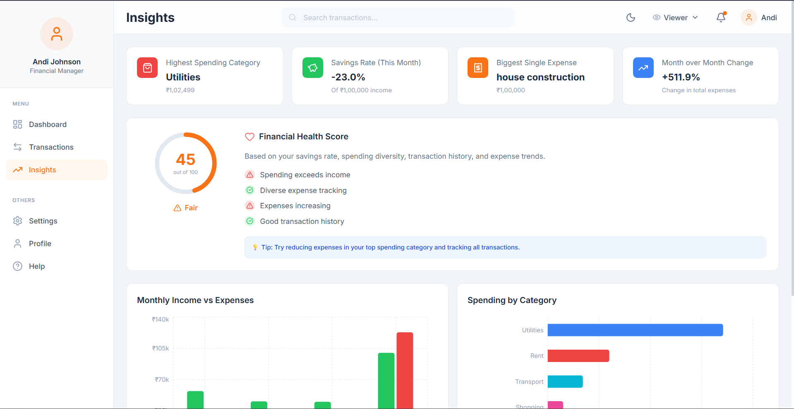
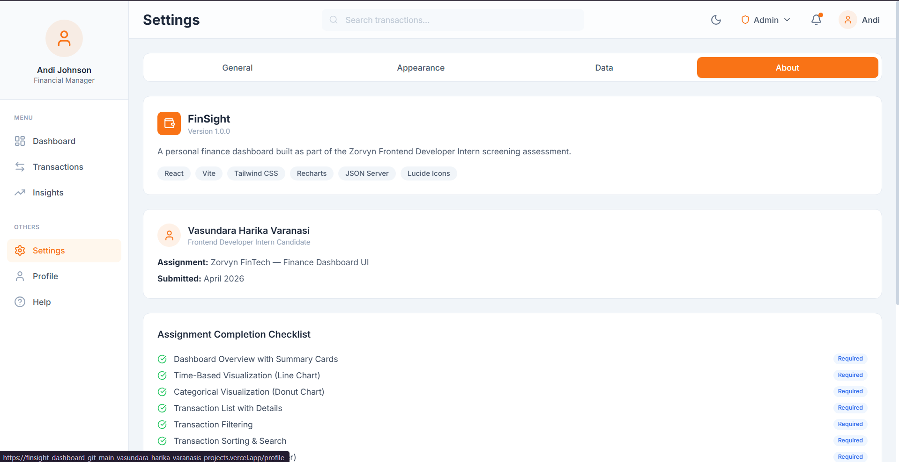
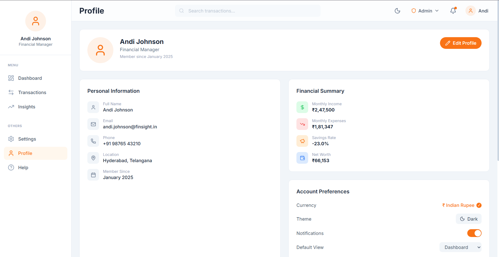
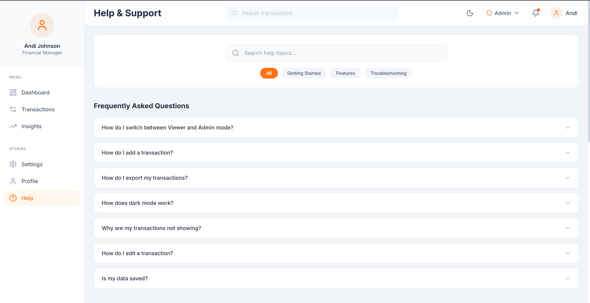

<div align="center">

# 💰 FinSight: Personal Finance Dashboard

### A professional-grade, role-based finance management interface for Zorvyn FinTech

[](https://react.dev/)
[](https://tailwindcss.com/)
[](https://vitejs.dev/)
[](https://recharts.org/)
[](https://vercel.com/)

[🌐 Live Demo](https://finsight-dashboard-git-main-vasundara-harika-varanasis-projects.vercel.app/) • [👩‍💻 GitHub](https://github.com/Vasundara-harika) • [💼 LinkedIn](https://www.linkedin.com/in/vasundara-harika-varanasi/)

</div>

---

## 📸 Screenshots

<div align="center">
<table>
  <tr>
    <td><br/><sub>Dashboard Overview</sub></td>
    <td><br/><sub>Dark Mode Interface</sub></td>
    <td><br/><sub>Transaction Management</sub></td>
  </tr>
  <tr>
    <td><br/><sub>Advanced Insights & Analytics</sub></td>
    <td><br/><sub>Profile Page</sub></td>
    <td><br/><sub>Settings Page</sub></td>
  </tr>
  <tr>
    <td><br/><sub>Help & Support</sub></td>
    <td><br/><sub>Dark Theme</sub></td>
  </tr>
</table>
</div>

---

## 📖 About

**FinSight** is a clean, interactive finance dashboard designed to provide users with deep clarity over their financial health. Built as part of a professional frontend assessment, it demonstrates mastery of modern frontend architecture, including **Role-Based Access Control (RBAC)**, complex data visualization, and responsive state management—all without relying on a dedicated backend.

---

## ✨ Features & Assignment Checklist

### Core Requirements (Completed ✅)
- 📊 **Dashboard Overview** — Real-time tracking of Total Balance, Income, and Expenses with time-period filtering (Week/Month/Year/All).
- 📈 **Time-Based Visualization** — Interactive line charts showing balance trends filtered by selected time range.
- 🥧 **Categorical Visualization** — Donut charts for spending breakdown by category.
- 📋 **Transaction Management** — Full list with Search, Category Filtering, Time Range, and Date/Amount Sorting.
- 🔐 **Role-Based UI** — Simulation of **Admin** (Add/Edit enabled) and **Viewer** (Read-only) roles.
- 💡 **Insights Section** — Dedicated analysis with bar charts for monthly comparisons.
- ⚛️ **State Management** — Robust implementation using React Context API.
- 📱 **Responsive Design** — Fully optimized for Mobile, Tablet, and Desktop views.

### Optional Enhancements (Implemented 🚀)
- 🌙 **Dark Mode** — Toggle with `localStorage` persistence.
- 💾 **Data Persistence** — Local storage used to keep data after page refreshes.
- ⚡ **Mock API Integration** — Full CRUD simulation using JSON Server.
- 📤 **Export to CSV** — One-click download of all transaction data.
- 🏥 **Financial Health Score** — Algorithmic calculation based on savings and expense ratios.
- 🔔 **Toast Notifications** — Instant user feedback for all actions.
- 🎨 **Animations** — Smooth transitions and Count-Up effects on summary cards.
- ⏱️ **Time-Period Filter** — Week, Month, Year, and All-Time selector across Dashboard and Transactions.
- 🚫 **404 Not Found Page** — Custom error page with clean design and navigation back to Dashboard.
- ⚙️ **Extra Pages** — Profile, Settings, and Help & FAQ documentation.

---

## 🛠️ Tech Stack

| Category | Technology |
|------------|---------|
| **Framework** | React 18 (Vite) |
| **Styling** | Tailwind CSS 3.4 |
| **Charts** | Recharts |
| **Icons** | Lucide React |
| **Routing** | React Router DOM v6 |
| **API Simulation** | JSON Server |
| **Deployment** | Vercel |

---

## 📁 Project Structure
```text
finance-dashboard/
├── src/
│   ├── components/       # Reusable UI (Charts, Modals, Tables, etc.)
│   ├── context/          # AppContext.jsx (Global state management)
│   ├── data/             # Static db.json for production fallback
│   ├── hooks/            # useTransactions.js & useCountUp.js
│   ├── pages/            # Dashboard, Transactions, Insights, Settings, etc.
│   ├── utils/            # api.js & helpers.js (formatting, logic)
│   └── App.jsx           # Routing & Layout configuration
├── public/               # Images, Favicons, and Screenshots
├── db.json               # Local database for JSON Server
├── tailwind.config.js    # Design system and theme tokens
├── vercel.json           # Deployment configuration (SPA routing fix)
└── package.json          # Dependencies and scripts
```

---

## 🚀 Getting Started

### Prerequisites
- Node.js >= 18
- npm

### Installation

**1. Clone the repository:**

```bash
git clone https://github.com/Vasundara-harika/finsight-dashboard.git
cd finsight-dashboard
```

**2. Install dependencies:**

```bash
npm install
```

**3. Run Mock API (Terminal 1):**

```bash
npx json-server --watch db.json --port 3001
```

**4. Run Application (Terminal 2):**

```bash
npm run dev
```

- React app runs at: **http://localhost:5173**
- JSON Server runs at: **http://localhost:3001**

### Build for Production

```bash
npm run build
npm run preview
```

---

## 🔐 Role-Based Access Control

| Feature | Viewer | Admin |
|---|---|---|
| View dashboard & charts | ✅ | ✅ |
| View transactions | ✅ | ✅ |
| Search, filter & date range | ✅ | ✅ |
| Export CSV / JSON | ✅ | ✅ |
| Add transaction | ❌ | ✅ |
| Edit transaction | ❌ | ✅ |
| Delete transaction | ❌ | ✅ |
| Bulk select & delete | ❌ | ✅ |
| Import transactions | ✅ | ✅ |

Switch roles using the dropdown in the navbar. The UI visibly changes — Admin sees action buttons, checkboxes, and delete icons that Viewer does not.

---

## 👩‍💻 Developer

**Vasundara Harika** — Final Year B.Tech Student | IIIT

---

<div align="center">

Made with ❤️ for the Zorvyn FinTech Assessment

⭐ Star this repo if you find it useful!

</div>
